# MonkeyCode 通讯时序图

## 一、Runner 注册流程

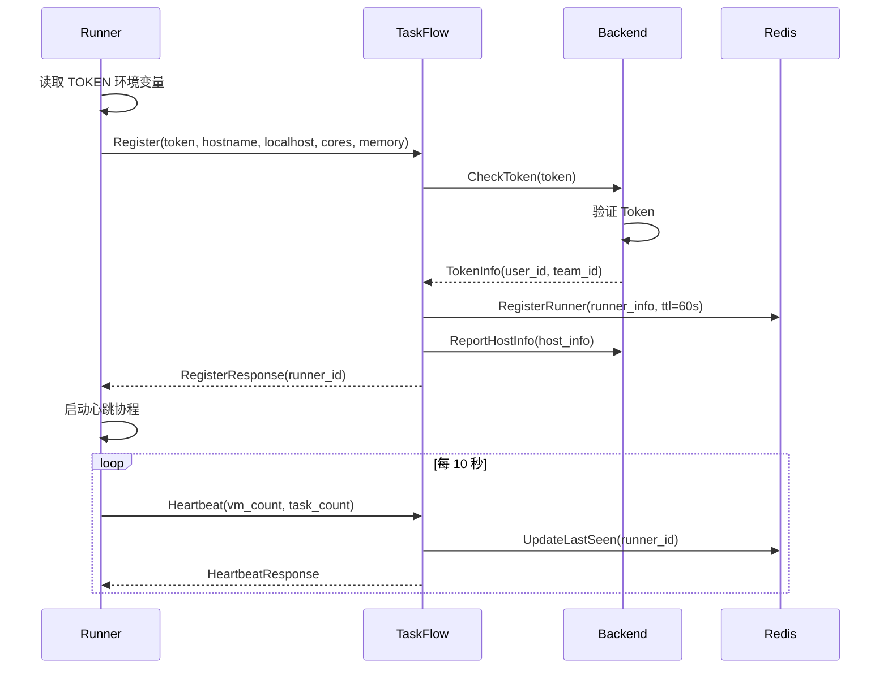

---

## 二、VM 创建流程

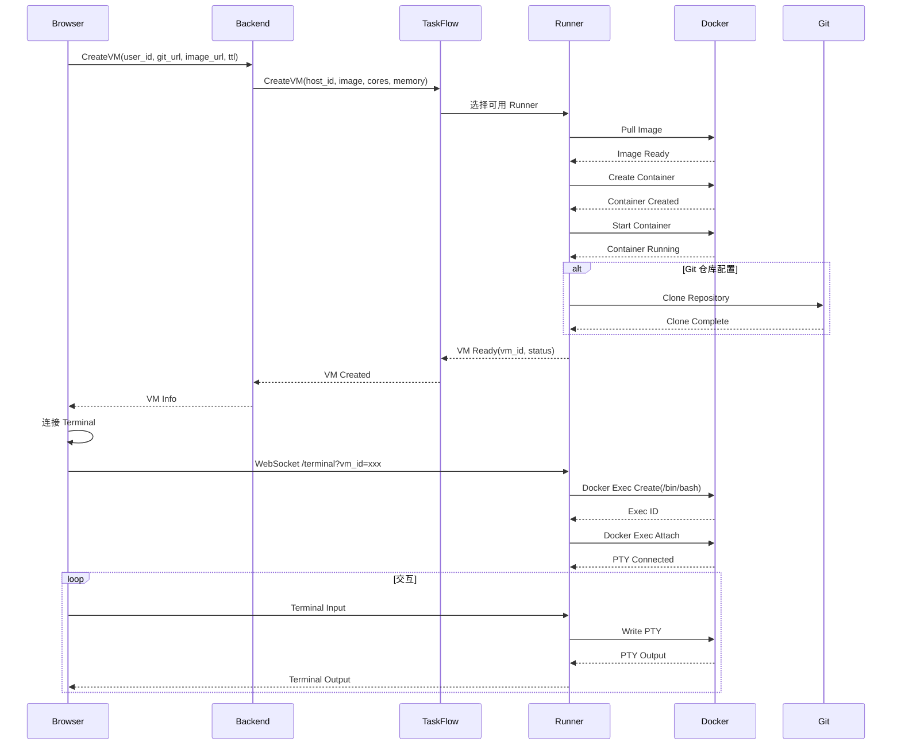

---

## 三、Task 执行流程

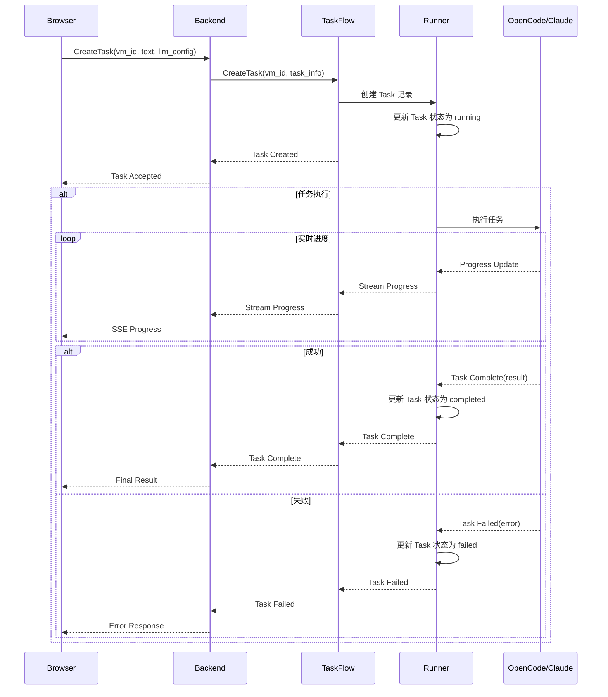

---

## 四、Token 认证流程

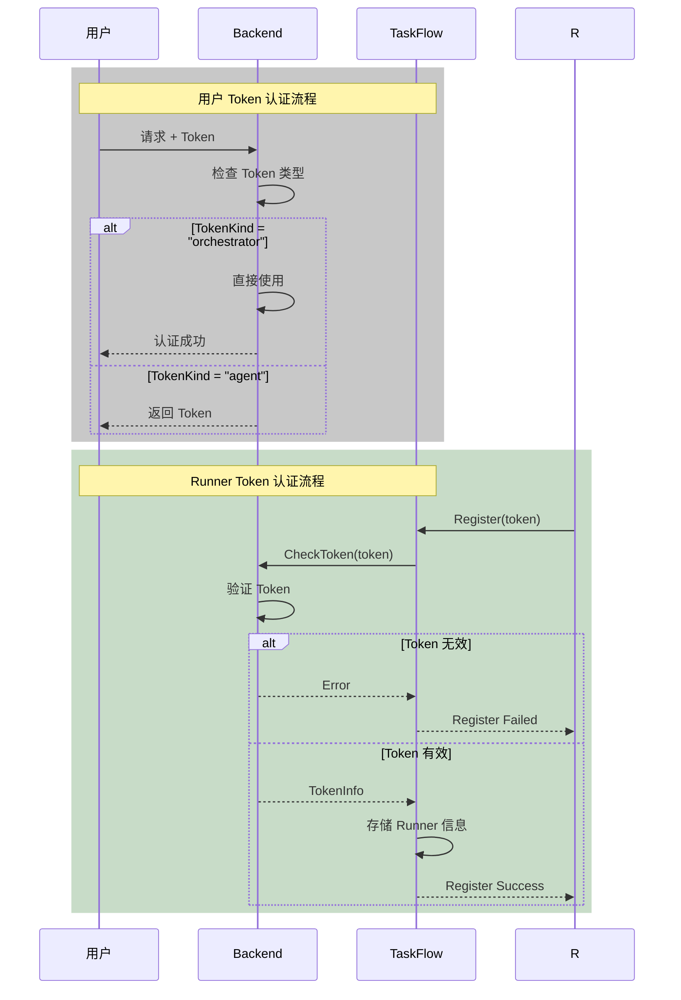

---

## 五、PortForward 流程

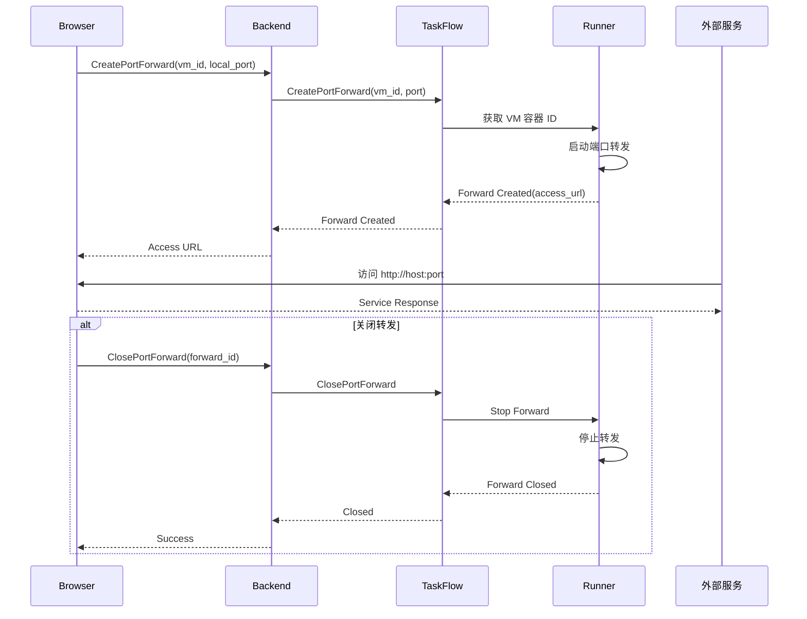

---

## 六、状态同步流程

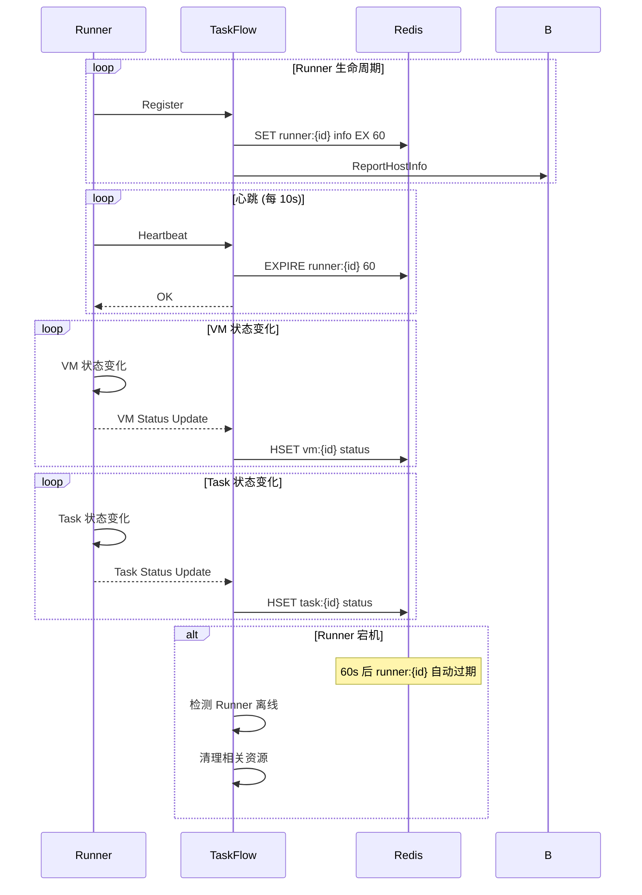

---

## 七、文件操作流程

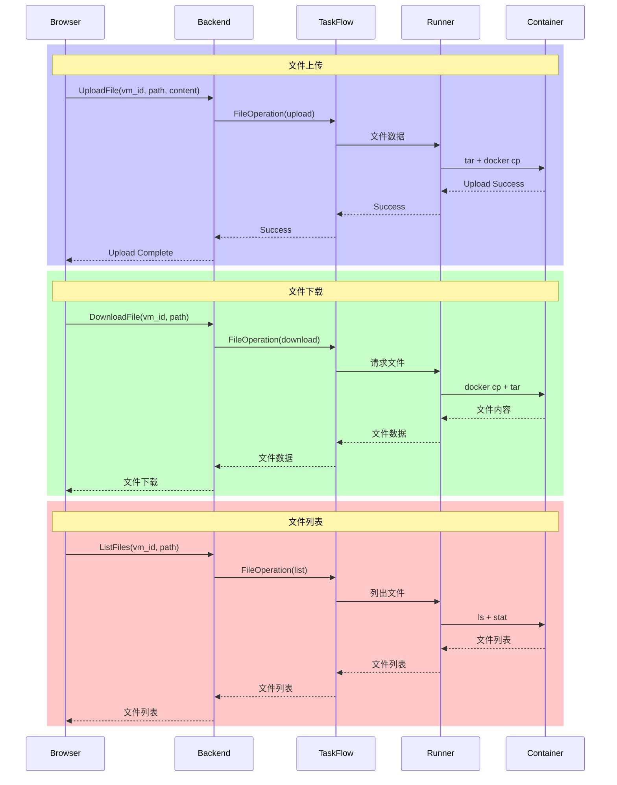

---

## 八、错误处理流程

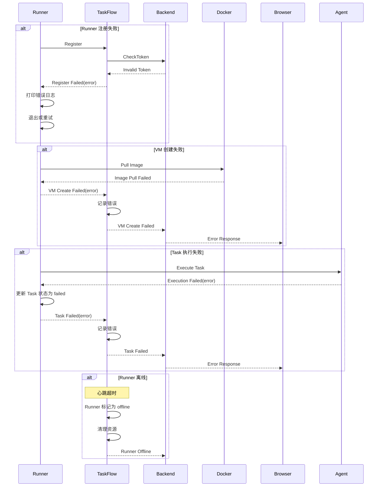

---

## 九、并发控制流程

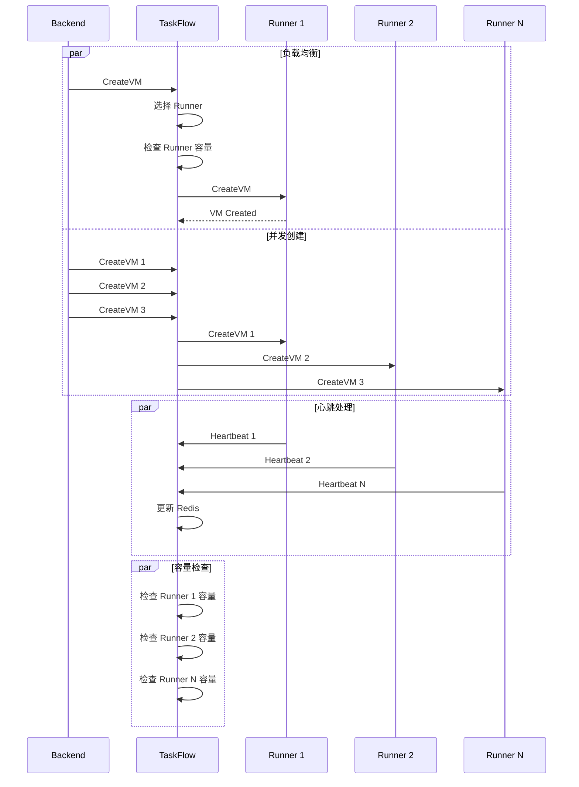

---

## 十、重连机制流程

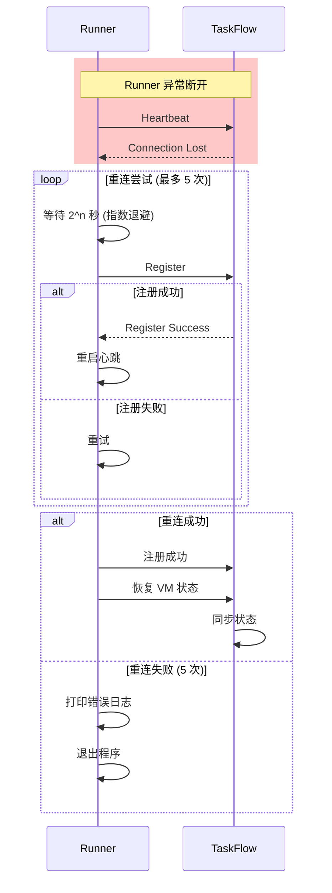

---

## 十一、健康检查流程

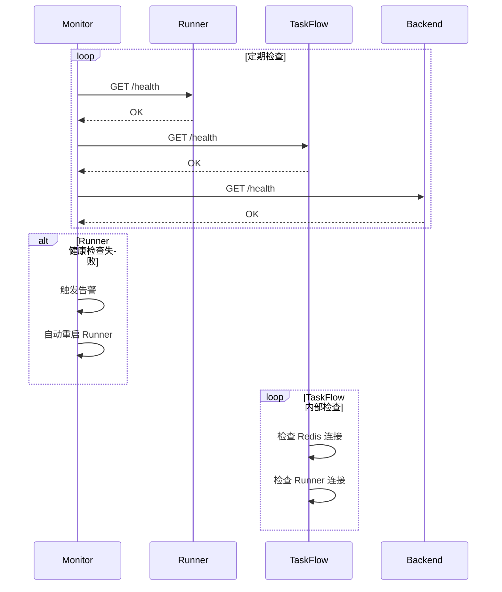

---

## 十二、数据流总览

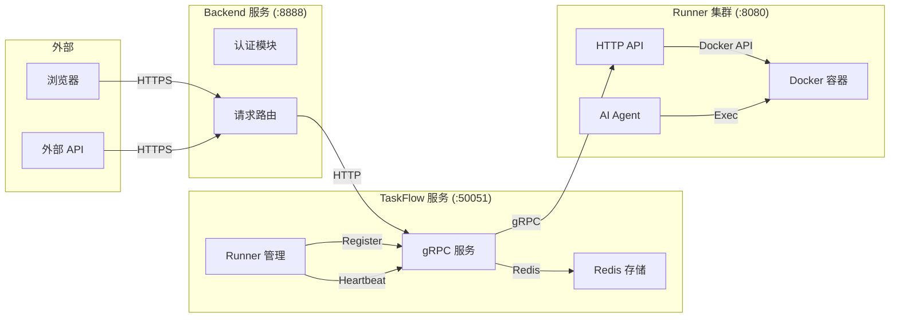

---

*本文档为 MonkeyCode 通讯流程的时序图补充说明*
